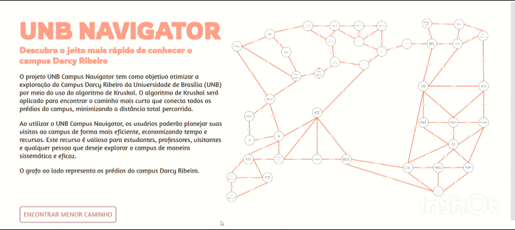

# tour_darcy

**Conteúdo da Disciplina**: Grafos 2<br>

## Alunos
|Matrícula | Aluno |
| -- | -- |
| 20/0025449  |  Natan Tavares Santana |
| 20/0036351  |  Clara Marcelino Ribeiro de Sousa |

## Sobre 
Esse site possui como objetivo retornar o menor caminho possível para se visitar todas os prédios do campus Darcy Ribeiro. Foi feito um mapeamento utilizando o google maps e as rotas que ele gera entre dois prédios. Os prédios mapeados foram:

> CAEP<br/>
> CET<br/>
> CDS<br/>
> Pavilhão Multiuso II<br/>
> Faculdade de educação<br/>
> BSAS<br/>
> FM/FS<br/>
> IQ<br/>
> IB<br/>
> SG9<br/>
> SG11<br/>
> SG12<br/>
> Oficinas Especiais<br/>
> Pavilhão Multiuso I<br/>
> Instituto de Artes<br/>
> Departamento de Música<br/>
> Auditório de Música<br/>
> Restaurante Universitário<br/>
> Faculdade de Tecnologia<br/>
> EFL<br/>
> Uleg-FT<br/>
> CCN<br/>
> PRC<br/>
> ICC<br/>
> Memorial Darcy Ribeiro<br/>
> Reitoria<br/>
> BCE<br/>
> Centro Comunitário Athos Bulcão<br/>
> CIC/EST<br/>
> FD<br/>
> FACE<br/>
> PAT<br/>
> PJC<br/>
> IPOL/IREL<br/>
> BAES<br/>
> BSAN<br/>
> ICS<br/>
> CEU Bloco K<br/>
> FEF<br/>
> CO<br/>
> CEU Bloco B<br/>
> CEU Bloco A<br/>

## Screenshots
<br/>
<br/>
<br/>

## Instalação 
**Linguagem**: Python<br>
**Framework**: Django<br>

Passos para rodar o projeto:
1- Instale o Django;
2- No diretório *tour_darcy*, rode ```python manage.py migrate```;
3- Ainda no diretório *tour_darcy*, rode ```python manage.py runserver```;

## Uso 
Para visualizar o resultado do processamento do algoritmo, basta clicar no botão "Encontrar Menor Caminho".


